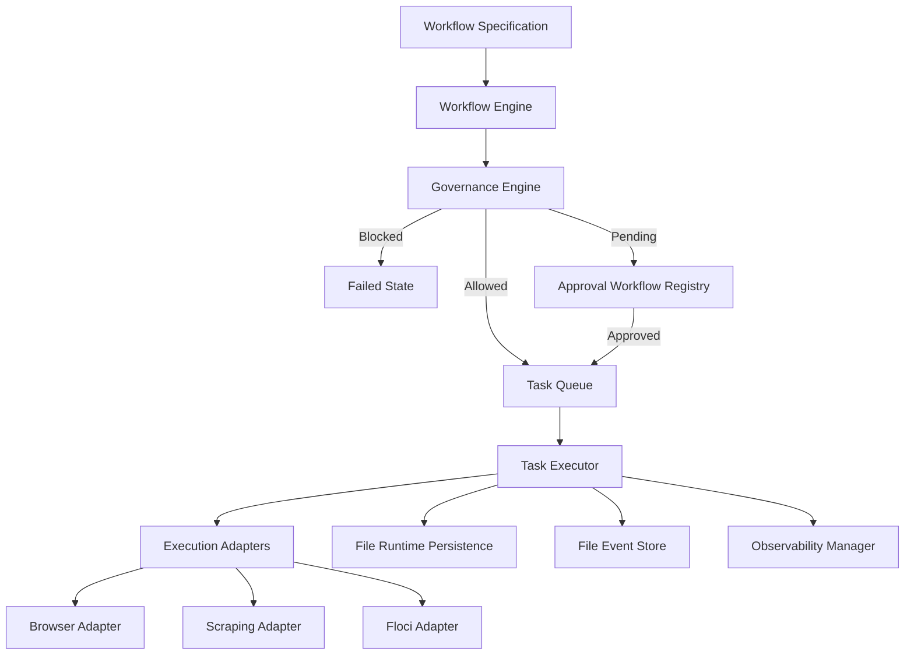

# GhostStack v1.2.0 System Architecture Blueprint

This document defines the production architecture, execution lifecycle, persistence schemas, local-first scheduling topology, and telemetry fabric of **GhostStack v1.2.0**.

---

## 1. Core Runtime Lifecycle & Dispatch Flow

The GhostStack execution pipeline processes structured workflows deterministically using an event-driven task consumer loop:

1. **Instantiation**: A workflow template is fetched from the `WorkflowRegistry` and initialized with variables as a concrete execution graph containing discrete tasks with dependency relations.
2. **Governance Gate Evaluation**: Before queuing any task, the `GovernanceEngine` evaluates it against safety policies. The task is routed to one of three gates:
   - **Allowed**: The task complies with sandboxing parameters. It is immediately enqueued.
   - **Blocked**: The task violates security constraints (e.g., path traversal inside host file schemas). Execution is halted.
   - **Pending Approval**: The task requests excessive resources (e.g., large data buffer sizes). It is held in the `ApprovalWorkflow` registry until a signed approval token is submitted.
3. **Queue Scheduling**: Tasks are pushed to the `MemoryQueueBackend`, sorting dynamically by priority weights (`high = 3`, `medium = 2`, `low = 1`) and creation time.
4. **Execution Loop**: The `TaskExecutor` pops the highest-priority job, assigns a unique `IExecutionContext`, selects the correct `IExecutionAdapter` based on task type matching, and drives the execution.
5. **State Persist & Telemetry**: Post-execution, task status is atomically saved in `FileRuntimePersistence`, and execution trace telemetry is logged to `FileEventStore` as JSONL stream objects.

---

## 2. Persistence & Replay Subsystem

GhostStack is designed to survive runtime crashes and guarantee crash-recovery consistency using historical event replay.

### 2.1 Concurrency Hardened File Persistence

To prevent race conditions, dirty reads, and filesystem locks under heavy concurrent stress, `FileRuntimePersistence` implements an async promise serialization queue (`writeQueue`):

- All state read and write transactions block sequentially until previous file I/O operations resolve.
- File modifications are performed atomically to prevent corrupt or partial JSON payloads.

### 2.2 Event Stream Replay Logic

During bootstrap, the orchestrator instantiates a `FileEventStore` and reads `events.jsonl` to recreate the exact in-memory state of active queues, task statuses, and execution counters:

- Prevents duplicate executions of completed tasks.
- Restores active workflow contexts transparently after a sudden power loss or process kill.

---

## 3. Local-First Scheduler & Queue Scheduling

The scheduling substrate operates entirely offline with zero dependencies on third-party services:

- **Priority Weights**: Jobs are sorted by priority and then by FIFO (First-In, First-Out) time index to prevent low-priority starvation.
- **Dead-Letter Management**: Failed tasks are retried up to `maxRetries: 3` with an exponential backoff factor before being permanently routed to the dead-letter queue, shielding healthy tasks from worker loop starvation.

---

## 4. Governed Cognitive Substrate & Approvals

GhostStack enforces a zero-trust model over execution plans:

- **Cognitive Trace**: Planners must write full cognitive justification tracks containing metrics, step justifications, and anticipated data boundaries.
- **Approval Gateways**: If quota sizes exceed baseline bounds, the orchestrator generates a signed approval record, freezing execution. Only when the record is explicitly marked as `approved` does the scheduler resume work.

---

## 5. Telemetry & Observability Fabric

Real-time diagnostic telemetry is built directly into all execution boundaries:

- **MetricsCollector**: Aggregates gauges (e.g., active queue lengths), counters (e.g., execution failures), and timing durations (e.g., adapter execution times).
- **TraceRecorder**: Tracks multi-step execution graphs through structured spans, recording trace IDs, task IDs, and spans for end-to-end audit trails.
