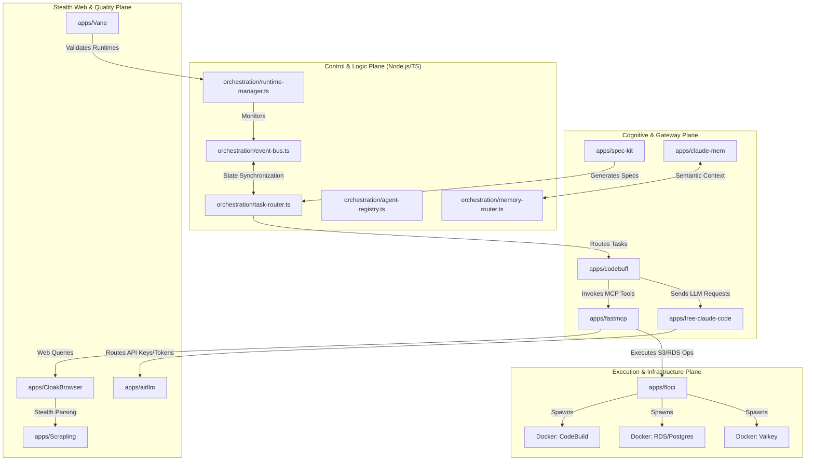

# GhostStack Core Orchestrator Implementation Plan

> **For Claude:** REQUIRED SUB-SKILL: Use superpowers:executing-plans to implement this plan task-by-task.

**Goal:** Establish the unified local-first autonomous cloud engineering runtime for GhostStack, coordinating all 10 core engines into a single, spec-driven cognitive automation substrate.

**Architecture:** A multi-runtime orchestration framework built on an asynchronous, schema-validated event loop. The system features a modular control plane in TypeScript/Node.js, coordinating micro-services in Python, Node.js, and Docker-containerized emulators (floci, Valkey, Postgres) with semantic memory routing and stealth web automation.

**Tech Stack:** TypeScript/Node.js (Orchestration/Control), Python (FastMCP, AirLLM, Scrapling, CloakBrowser), Docker Compose (floci & local database services), JSON Schema, YAML config, and custom TCP/SSE event buses.

---

## 1. System Topology & Component Interactions

The following architecture diagram outlines how the 10 components interact through the control, data, and cognitive planes:



---

## 2. Directory Layout & Registry Analysis

The workspace is organized into discrete directories representing the control plane, definitions, and application nodes:

| Path             | Primary Engine      | Language/Type      | Role / Purpose                                                                                    |
| :--------------- | :------------------ | :----------------- | :------------------------------------------------------------------------------------------------ |
| `orchestration/` | Core Loop           | TypeScript         | Handles orchestrator lifecycle, event dispatching, memory routing, and agent registry             |
| `runtime/`       | Host Environment    | YAML / TS          | Defines port assignments, healthy daemon definitions, system healthchecks, and boot configuration |
| `schemas/`       | Validation Plane    | JSON Schema        | Dictates the API contracts for Agent Messages, Tasks, Memory states, and Runtime status           |
| `specs/`         | Feature definitions | Markdown / Specs   | Stores spec-kit feature files and implementation plans                                            |
| `apps/`          | Integrations        | Git Submodules/Src | Subfolders for each of the 10 components (`floci`, `spec-kit`, `codebuff`, etc.)                  |

---

## 3. Data Flow & Contract Analysis

Contracts are verified utilizing JSON schema validation. Three primary contracts govern the orchestrator:

1. **Task Contract (`schemas/task.schema.json`)**:
   ```json
   {
     "id": "task-uuid-v4",
     "title": "Provision Database",
     "description": "Initialize a local RDS instance in floci",
     "priority": "high",
     "status": "pending",
     "dependencies": []
   }
   ```
2. **Message Contract (`schemas/agent-message.schema.json`)**:
   ```json
   {
     "sender": "spec-kit",
     "receiver": "codebuff",
     "timestamp": "2026-05-18T15:00:00Z",
     "message": "Specs created. Execute implementation plan.",
     "task_id": "task-uuid-v4"
   }
   ```
3. **Orchestration State (`schemas/orchestration.schema.json`)**:
   ```json
   {
     "workflow_id": "flow-uuid-v4",
     "active_agents": ["spec-kit", "codebuff"],
     "state": "running",
     "started_at": "2026-05-18T15:00:00Z"
   }
   ```

---

## 4. Architectural Synthesis

The Orchestrator combines all 10 systems:

- **Floci** handles the emulation of the AWS stack.
- **Spec-Kit** dictates requirements.
- **Codebuff** executes refactoring.
- **Free-Claude-Code** intercepts Sonnet/Haiku request loops.
- **FastMCP** serves local tooling to the agents.
- **CloakBrowser** and **Scrapling** execute stealth data crawling.
- **AirLLM** hosts local validation models.
- **Claude-Mem** serves memory contexts.
- **Vane** executes quality verification checks.

---

## 5. Execution Tasks & Implementation Steps

We follow TDD with strict validation.

### Task 1: Initialize System Configurations

**Files:**

- Create: `runtime/ports.yaml`
- Create: `runtime/services.yaml`
- Create: `runtime/healthchecks.yaml`
- Create: `runtime/ghoststack.runtime.yaml`
- Test: `tests/runtime_config.test.ts`

**Step 1: Write the config tests**
Create `tests/runtime_config.test.ts` to ensure configurations load correctly:

```typescript
import * as fs from "fs";
import * as path from "path";
import * as yaml from "js-yaml";

describe("Runtime Configurations", () => {
  it("should contain standard YAML profiles", () => {
    const ports = yaml.load(fs.readFileSync(path.join(__dirname, "../runtime/ports.yaml"), "utf8")) as any;
    expect(ports.floci).toBe(4566);
    expect(ports.fcc).toBe(8082);
    expect(ports.mcp).toBe(8000);
    expect(ports.ollama).toBe(11434);
  });
});
```

**Step 2: Run test to verify it fails**
Run: `npm test tests/runtime_config.test.ts`
Expected: FAIL (missing files or dependencies)

**Step 3: Write minimal implementation**
Create the config files:

_`runtime/ports.yaml`:_

```yaml
floci: 4566
fcc: 8082
mcp: 8000
ollama: 11434
claude-mem: 8088
```

_`runtime/services.yaml`:_

```yaml
services:
  floci:
    image: floci/floci:latest
    type: docker
    port: 4566
  fcc:
    cmd: fcc-server
    type: process
    port: 8082
  mcp:
    cmd: fastmcp run server.py
    type: process
    port: 8000
  ollama:
    type: external
    port: 11434
```

_`runtime/healthchecks.yaml`:_

```yaml
healthchecks:
  floci:
    path: /_floci/health
    interval: 5000
  fcc:
    path: /admin
    interval: 2000
  mcp:
    path: /mcp
    interval: 2000
```

_`runtime/ghoststack.runtime.yaml`:_

```yaml
version: "1.0.0"
environment: development
primary_llm: remote
local_backup: qwen2.5:7b
storage:
  mode: hybrid
  interval_sec: 5
```

**Step 4: Run test to verify it passes**
Run: `npm test tests/runtime_config.test.ts`
Expected: PASS

**Step 5: Commit**

```bash
git add runtime/
git commit -m "feat: implement baseline configuration architecture"
```

---

### Task 2: Build the Event Bus & Task Router

**Files:**

- Modify: `orchestration/event-bus.ts`
- Modify: `orchestration/task-router.ts`
- Test: `tests/orchestration.test.ts`

**Step 1: Write the failing orchestration test**
Create `tests/orchestration.test.ts`:

```typescript
import { EventBus } from "../orchestration/event-bus";
import { TaskRouter } from "../orchestration/task-router";

describe("Event Bus & Task Routing", () => {
  it("should process and route agent tasks with dependency resolution", async () => {
    const bus = new EventBus();
    const router = new TaskRouter(bus);

    const task = {
      id: "task-01",
      title: "Scrape Data",
      description: "Extract news feed",
      priority: "high",
      status: "pending",
      dependencies: []
    };

    const resolved = await router.route(task);
    expect(resolved.status).toBe("routed");
  });
});
```

**Step 2: Run test to verify it fails**
Run: `npm test tests/orchestration.test.ts`
Expected: FAIL (types not resolved, or file empty)

**Step 3: Write minimal implementation**
Create/Modify files:

_`orchestration/event-bus.ts`:_

```typescript
import { EventEmitter } from "events";

export class EventBus extends EventEmitter {
  publish(event: string, data: any) {
    this.emit(event, data);
  }

  subscribe(event: string, handler: (data: any) => void) {
    this.on(event, handler);
  }
}
```

_`orchestration/task-router.ts`:_

```typescript
import { EventBus } from "./event-bus";

export interface Task {
  id: string;
  title: string;
  description: string;
  priority: string;
  status: string;
  dependencies: string[];
}

export class TaskRouter {
  private bus: EventBus;
  private queue: Task[] = [];

  constructor(bus: EventBus) {
    this.bus = bus;
  }

  async route(task: Task): Promise<Task> {
    task.status = "routed";
    this.queue.push(task);
    this.bus.publish("task_routed", task);
    return task;
  }
}
```

**Step 4: Run test to verify it passes**
Run: `npm test tests/orchestration.test.ts`
Expected: PASS

**Step 5: Commit**

```bash
git add orchestration/
git commit -m "feat: implement event-bus and task routing pipeline"
```

---

### Task 3: Setup Runtime Manager & Orchestrator Shell

**Files:**

- Modify: `orchestration/runtime-manager.ts`
- Modify: `runtime/orchestrator.ts`
- Test: `tests/runtime_manager.test.ts`

**Step 1: Write the failing runtime manager test**
Create `tests/runtime_manager.test.ts`:

```typescript
import { RuntimeManager } from "../orchestration/runtime-manager";

describe("Runtime Manager", () => {
  it("should detect active services and parse service health status", async () => {
    const rm = new RuntimeManager();
    const active = await rm.getActiveServices();
    expect(active.length).toBeGreaterThanOrEqual(0);
  });
});
```

**Step 2: Run test to verify it fails**
Run: `npm test tests/runtime_manager.test.ts`
Expected: FAIL

**Step 3: Write minimal implementation**
Create/Modify files:

_`orchestration/runtime-manager.ts`:_

```typescript
import * as fs from "fs";
import * as path from "path";
import * as yaml from "js-yaml";

export class RuntimeManager {
  private configPath = path.join(__dirname, "../runtime/services.yaml");

  async getActiveServices(): Promise<string[]> {
    try {
      const content = fs.readFileSync(this.configPath, "utf8");
      const data = yaml.load(content) as any;
      return Object.keys(data?.services || {});
    } catch {
      return [];
    }
  }
}
```

_`runtime/orchestrator.ts`:_

```typescript
import { RuntimeManager } from "../orchestration/runtime-manager";
import { EventBus } from "../orchestration/event-bus";
import { TaskRouter } from "../orchestration/task-router";

export class GhostStackOrchestrator {
  private runtimeManager: RuntimeManager;
  private eventBus: EventBus;
  private taskRouter: TaskRouter;

  constructor() {
    this.runtimeManager = new RuntimeManager();
    this.eventBus = new EventBus();
    this.taskRouter = new TaskRouter(this.eventBus);
  }

  async start() {
    console.log("Starting GhostStack Unified Orchestrator...");
    const services = await this.runtimeManager.getActiveServices();
    console.log(`Active services: ${services.join(", ")}`);
  }
}
```

**Step 4: Run test to verify it passes**
Run: `npm test tests/runtime_manager.test.ts`
Expected: PASS

**Step 5: Commit**

```bash
git add orchestration/ runtime/
git commit -m "feat: complete unified runtime manager and orchestrator start routine"
```

---

## 6. Execution Choice Handoff

Plan complete and saved to `docs/plans/2026-05-18-ghoststack-core-orchestrator.md`. Two execution options:

**1. Subagent-Driven (this session)** - I dispatch fresh subagent per task, review between tasks, fast iteration
**2. Parallel Session (separate)** - Open new session with executing-plans, batch execution with checkpoints

Which approach?
